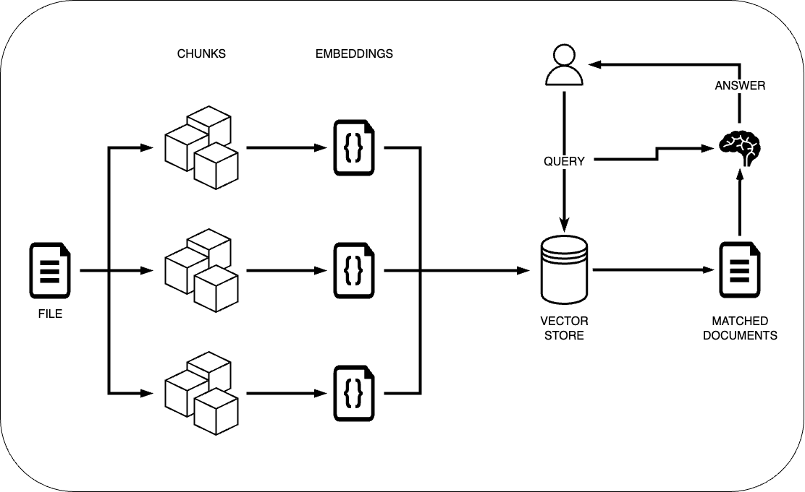

# STUDENTS GPT

## What is it
Repository for the JARVIS PDF-Chatbot. Detailed report about the development process as well as some learnings can be found [here](./report.pdf).

### Project Scope
Building Process that accepts user inputs as well as files, processes these files and search for user input.
The following image describes the process schematically:
<br>

<br>
An intuitive and interactive user interface is created using [streamlit](https://streamlit.io).

### Text Extraction
- Python lib vs OCR
  - python lib: structure based text extraction -> no format context
  - OCR: ML based approach to additionally detect document structure for more complete information
- Custom OCR model based on [LayoutParser](https://github.com/Layout-Parser/layout-parser)
- Annotations done via [LabelStudio](https://labelstud.io/)
- Training done on local RTX 2070S GPU ~2h
- Shows promise, but not enough to provide a reliable benefit over simple python extraction
- Ended up with structure based extraction due to time / effort constraints in regards to building a fully functional custom OCR model
- Further instructions and implementation example [here](documentation/Customizing%20Layout%20Models%20with%20Label%20Studio%20Annotation.ipynb)

### Semantic Chunking
In order to improve the way how the text is splitted, we implemented a different approach. This approach tries to identifies chunk points based on semantics. Further explanaition and code can be found [here](documentation/semantic_chunking.ipynb)

### Models
- we tested three models using a open source lecture set from MIT -> [Lecture Notes](data/test_lecture_set.pdf)
- The Models are:
  - [Falcon-7B-instruct](https://huggingface.co/tiiuae/falcon-7b-instruct)
  - [FLAN-T5-xxl](https://huggingface.co/google/flan-t5-xxl)
  - [DistilBERT finetuned on SQuAD](https://huggingface.co/distilbert-base-uncased-distilled-squad)
- Models are compaired and evaluated based on the following categories
- Evaluation and test results can be found [here]()

## Collaborators
+ Lars Kurschilgen
+ Nicholas Link
+ Alexander Paul
+ Adrian Setz
+ Lucas Wätzig
+ Jan Wolter


## Requirements

1. Clone Repository
2. Create a virtual python environment -> [Link](https://realpython.com/lessons/creating-virtual-environment/)
3. Install required packages listed in [requirements.txt](./requirements.txt)
4. The Application is build using streamlit. To run the app execute the following command in the projects directory ```streamlit run app.py```
5. The app will open in a new browser tab. If not follow the link displayed in your terminal

